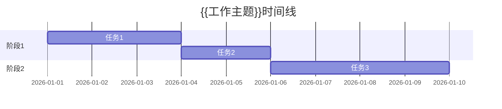

# {{工作主题}}

## 📋 工作概述
### 工作背景
{{为什么需要做这项工作}}

### 工作目标
- 主要目标：{{目标1}}
- 次要目标：{{目标2}}
- 成功标准：{{标准}}

### 工作范围
- 包含：{{范围内容}}
- 不包含：{{排除内容}}

## 🛠️ 工作过程
### 时间线


### 关键步骤
1. **步骤1：{{步骤名称}}**
   - 操作：{{具体操作}}
   - 结果：{{操作结果}}
   - 问题：{{遇到的问题}}

2. **步骤2：{{步骤名称}}**
   - 操作：{{具体操作}}
   - 结果：{{操作结果}}
   - 问题：{{遇到的问题}}

3. **步骤3：{{步骤名称}}**
   - 操作：{{具体操作}}
   - 结果：{{操作结果}}
   - 问题：{{遇到的问题}}

### 技术细节
```代码/配置示例
{{具体技术内容}}
```

## 📊 工作成果
### 完成内容
- [x] {{完成项1}}
- [x] {{完成项2}}
- [x] {{完成项3}}

### 产出物
- 文档：{{文档列表}}
- 代码：{{代码仓库}}
- 报告：{{报告文件}}

### 数据指标
- **完成度**：{{百分比}}%
- **用时**：{{实际用时}}
- **质量**：{{质量评估}}

## 💡 经验总结
### 成功经验
- {{经验1}}
- {{经验2}}
- {{经验3}}

### 失败教训
- {{教训1}}
- {{教训2}}
- {{教训3}}

### 改进建议
- {{建议1}}
- {{建议2}}
- {{建议3}}

## 🔄 后续工作
### 待完成事项
- [ ] {{事项1}}
- [ ] {{事项2}}

### 后续计划
- **短期**：{{计划1}}
- **中期**：{{计划2}}
- **长期**：{{计划3}}

### 依赖关系
- 依赖的任务：{{任务列表}}
- 被依赖的任务：{{任务列表}}

## 📝 工作日志
### {{日期1}}
- {{工作内容1}}
- {{工作内容2}}

### {{日期2}}
- {{工作内容1}}
- {{工作内容2}}

## 🔗 相关资源
### 参考文档
- {{文档1}}：{{链接}}
- {{文档2}}：{{链接}}

### 使用工具
- {{工具1}}：{{用途}}
- {{工具2}}：{{用途}}

### 相关人员
- {{人员1}}：{{角色}}
- {{人员2}}：{{角色}}

---

*工作开始：{{开始时间}}*
*工作结束：{{结束时间}}*
*记录人：{{记录人}}*
*最后更新：{{更新时间}}*