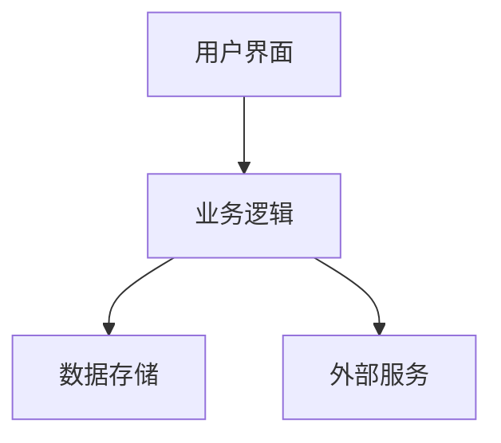

# {{项目名称}}

## 🎯 项目概述
### 项目愿景
{{项目要实现的最终目标}}

### 核心价值
- {{价值1}}
- {{价值2}}
- {{价值3}}

### 目标用户
- {{用户群体1}}
- {{用户群体2}}

## 📋 项目需求
### 功能需求
- [ ] {{功能1}}
- [ ] {{功能2}}
- [ ] {{功能3}}

### 非功能需求
- **性能要求**：{{要求}}
- **可用性要求**：{{要求}}
- **安全性要求**：{{要求}}

## 🏗️ 技术方案
### 技术栈选择
- **前端**：{{技术}}
- **后端**：{{技术}}
- **数据库**：{{技术}}
- **部署**：{{技术}}

### 架构设计

### 关键技术点
- {{技术点1}}
- {{技术点2}}

## 📅 实施计划
### 阶段1：{{阶段名称}}
- **时间**：{{开始时间}} - {{结束时间}}
- **目标**：{{阶段目标}}
- **任务**：
  - [ ] {{任务1}}
  - [ ] {{任务2}}

### 阶段2：{{阶段名称}}
- **时间**：{{开始时间}} - {{结束时间}}
- **目标**：{{阶段目标}}
- **任务**：
  - [ ] {{任务1}}
  - [ ] {{任务2}}

## 📊 资源评估
### 时间资源
- 总预计时间：{{总时间}}
- 关键里程碑：{{里程碑}}

### 技术资源
- 需要学习的技术：{{技术列表}}
- 需要使用的工具：{{工具列表}}

### 人力资源
- 需要的人员角色：{{角色列表}}
- 需要的技能：{{技能列表}}

## 💰 价值评估
### 商业价值
- {{价值点1}}
- {{价值点2}}

### 学习价值
- {{学习收获1}}
- {{学习收获2}}

### 社会价值
- {{社会影响1}}
- {{社会影响2}}

## ⚠️ 风险评估
### 技术风险
- {{风险1}} → 应对措施：{{措施}}
- {{风险2}} → 应对措施：{{措施}}

### 时间风险
- {{风险1}} → 应对措施：{{措施}}
- {{风险2}} → 应对措施：{{措施}}

### 资源风险
- {{风险1}} → 应对措施：{{措施}}
- {{风险2}} → 应对措施：{{措施}}

## 🔗 相关资源
### 参考项目
- {{项目1}}：{{链接}}
- {{项目2}}：{{链接}}

### 学习资料
- {{资料1}}：{{链接}}
- {{资料2}}：{{链接}}

### 工具资源
- {{工具1}}：{{链接}}
- {{工具2}}：{{链接}}

## 📝 决策记录
### 为什么做这个项目？
{{决策理由}}

### 为什么现在做？
{{时机分析}}

### 为什么由我做？
{{优势分析}}

---

*项目创建：{{创建时间}}*
*项目状态：{{当前状态}}*
*最后更新：{{更新时间}}*